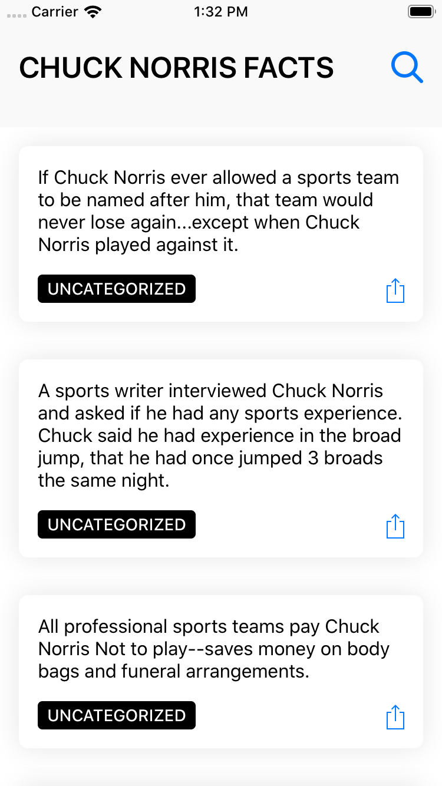

# Chuck_Norris_Facts
App with all real facts about Chuck Norris !



## Stack

- [RxSwift](https://github.com/ReactiveX/RxSwift)
- [RxDataSources](https://github.com/RxSwiftCommunity/RxDataSources)
- [RxCoreData](RxCoreData)
- [Reachability.swift](https://github.com/ashleymills/Reachability.swift)

## Architecture

The app uses a mix of MVC and MVVM, Rx is used for bindings and every fact is
downloaded from the API and gets stored locally (in CoreData).

## Building

Building the app requires [Carthage](https://github.com/Carthage/Carthage).

After clone the repo, install the dependencies:

```
carthage bootstrap --platform iOS
```
